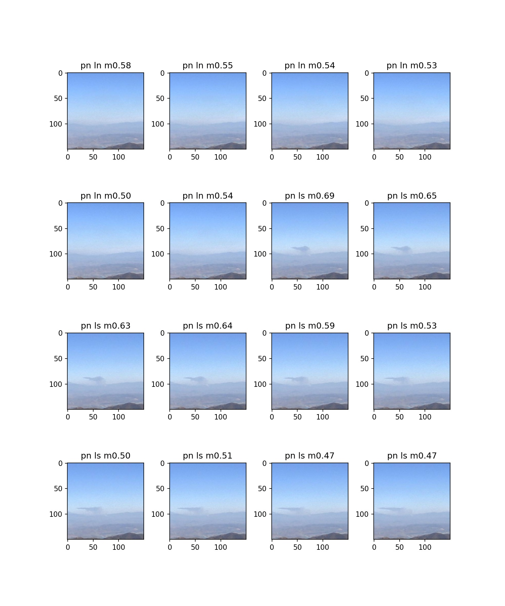

# fire_trainer
Using simulated aerial fire images to validate classification of real fire images.

# TFLite version 1.15.rc2
At the end of the training sequence the frozen network is quantized and saved using
TFLite.  The resulting TFLite network can then be used by other compilers for inference only devices, such as the Edge TPU.  

# Test Results (CPU/GPU trained)
The images which appear below were tested with a network trained using only the simulated fire
images generated by the Unity scripts in the Traingen project.  The title of each image indicates
whether the network detected smoke and may be interpreted as follows:


The title of each image is interpreted as follows:
```
ps = Predicted Smoke
ls = Labeled Smoke
pn = Predicted No Smoke
ln = Labeled No Smoke
```

If the prediction was correct the second character will match, as in: "ps ls" and "pn ln"

The other characters appearing after these contain the last few characters of the file name. 

**The images appearing below represent an overall test accuracy of: 0.90**




# Test Results (quantized for Edge TPU)
Installing the runtime for the USB Edge TPU:
https://coral.ai/docs/accelerator/get-started/

Installing the interpreter:
https://www.tensorflow.org/lite/guide/python

Running the quantized model produced at the end of the training process is described 
here: https://coral.ai/docs/edgetpu/inference/


# Notes
- The number of training and validation files must be evenly divisible by 10.
- Development of the training source code was performed on a Windows PC with VSCode,
used for execution and setting break points.

# TODO:
- Evaluate the performance of the test data after each epoch, and make this the primary
  criteria for identifying the best training parameters.
- Remove the hard coded constants used to define the dimensions of the training data and
  replace with named constants (no magic numbers).
- Cache the calculate features for unchanged images.
- Conduct training from scratch (i.e. do not use transfer learning).
- Time for false positive testing on actual aerial stills?
