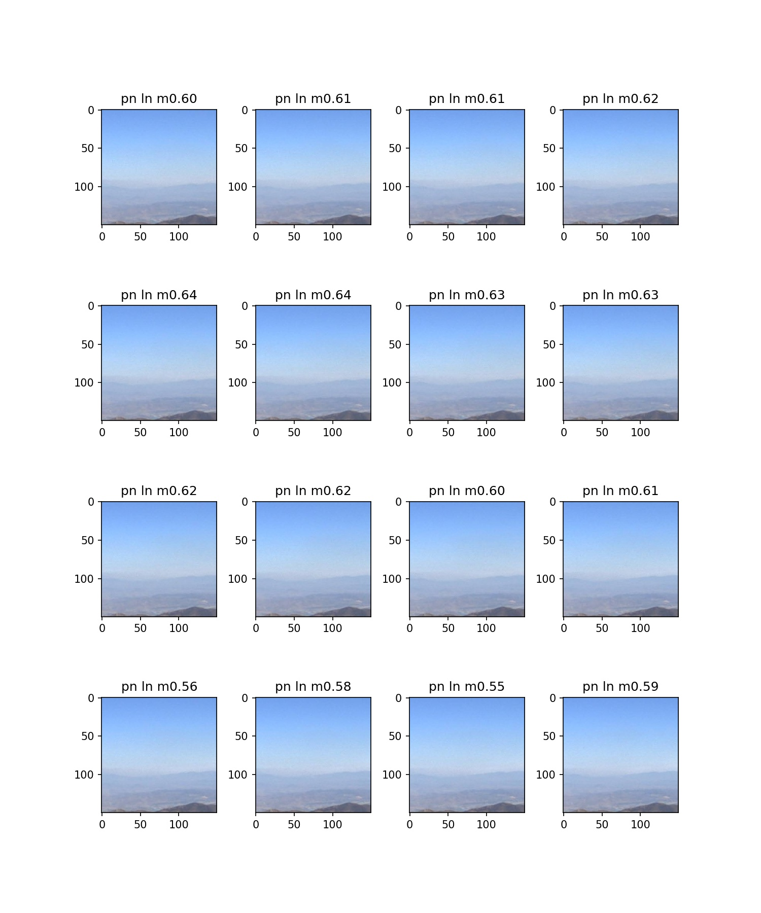

# fire_trainer
Using simulated aerial fire images to validate classification of real fire images.

# Test Results
The images which appear below were tested with a network trained using only the simulated fire
images generated by the Unity scripts in the Traingen project.  The title of each image indicates
whether the network detected smoke and may be interpreted as follows:


The title of each image is interpreted as follows:
```
ps = Predicted Smoke
ls = Labeled Smoke
pn = Predicted No Smoke
ln = Labeled No Smoke
```

If the prediction was correct the second character will match, as in: "ps ls" and "pn ln"

The other characters appearing after these contain the last few characters of the file name. 

**The images appearing below represent an overall test accuracy of: 0.90**





# Notes
- The number of training and validation files must be evenly divisible by 10.
- Development of the training source code was performed on a Windows PC with VSCode,
used for execution and setting break points.

# Left off:
- Add the code needed to save the training weights for the lowest validation loss. 
  Consult Keras book for sample code.
- Time for false positive testing on actual aerial stills?
